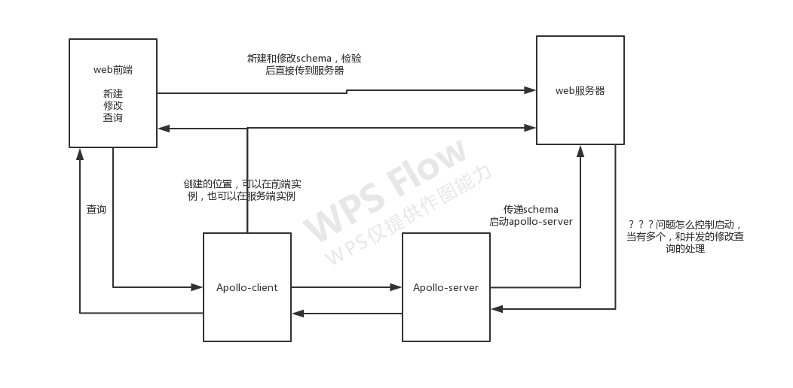

#### graphql实践和个人理解--接口中心新加graphql接口类型

一。 graphql的官方说明
>个人理解：graphql是一种新的数据格式。

graphql 本身提供了一整套关于解析，校验，通过输入query查找输出结构的api。具体细节自行查看文档。
这里简单在说一下使用。
对于使用我们需要先知道两个概念。一个是schema，可以理解为这个全量的数据的结构，然后是query，理解为需要查询的条件。

schema: 
1. 类型声明字段:type,union,interface,input,enum,scalar
2. 类型分类：对象（用type,scalar声明），联合(union)，接口（interface），枚举（enum），标量（scalar）
3. 个人理解在分类：
    类对象结构：声明字段 type,union,interface,input
    枚举结构：声明字段 enum
    基础结构类型（标量类型）：声明字段 scalar， 包括默认标量类型（Int：有符号 32 位整数；Float：有符号双精度浮点值；String：UTF‐8 字符序列；Boolean：true 或者 false；ID：ID 标量类型表示一个唯一标识符，通常用以重新获取对象或者作为缓存中的键。ID 类型使用和 String 一样的方式序列化；然而将其定义为 ID 意味着并不需要人类可读型。）和自定义标量类型。

4. !!!查找graphQL的入口：query 和 mutation 字段，定义的是操作方法

5. 基本的一个schema类型组成结构：
    类型声明字段 + 对象名称 + 引用修饰（可选项） {
        字段（field）+  参数（可选项+默认值） + 类型对象（更多是指向另一个具体对象） + 类型修饰符
    }

栗子：schema
```
type Query {
   greeting:String
   students:[Student]
   test:ColorType
   studentById(id:ID!):Student
   sayHello(name:String!):String
}
enum ColorType {
   RED
   BLUE
   GREEN
}
type Student {
   id:ID!
   firstName:String
   lastName:String
   password:String
   collegeId:String
   fullName:String
   college: College
}
```


-----
query(指行为，并不是query类型对象)
 基本的一个query类型组成结构：
 操作类型（query,mutation,subscription）+ 操作名称 + 变量(变量名+变量类型or默认值){
     字段（fields）+别名（可选值） + 参数（参数的值） + 指令（可选择）{
         所需结构字段
         or
         fragment片段
         or
         内联片段
     }
 }

```
query HeroNameAndFriends($episode: Episode) {
  hero(episode: $episode) {
    name
    friends @include(if: $withFriends){ //指令
      name
    }
  }
  rightComparison: hero(episode: $episode) {
    ...comparisonFields
  }
}

fragment comparisonFields on Character {
  name
  friendsConnection(first: $first) {
    totalCount
    edges {
      node {
        name
      }
    }
  }
}
```

>补充：参照graphql的使用，如下
     graphql(schema, query, root)
        .then((response)=>{ console.log(response);});
    还有一个root结构需要关注。
> root：The root provides a resolver function for each API endpoint
也就是对于每一个入口文件的属性，需要提供一个处理函数。也就是说后端其实也是对应这份结构给出每一个方法应该的返回结构。


二。 接口中心graphql任务流程图。
1. 接口中心的目的：
    * 能够新建和编辑graphql文件。
    * 能够通过输入得到输出数据。
2. 大致流程（关于对graphql的操作）

   * 前端页面：(校验schema和query)
    上传schema文件时，需要校验schema文件是否符合标准，
    通过query查询结果时，也需要校验query的结构是否符合标准。

    > 个人思考：（有些累赘）
    个人理解graphql也是一层，一个夹在前后端之间，方便数据交互的一个数据结构规范。
    这里的前后端，除了客户端和服务端，还有人和程序。如果是单纯客户端和后端之间识别的数据结构的话，就可以直接定义类似树型结构的数据或者更贴近程序识别和执行的结构（二进制？）。类比二进制--机器码--高级程序语言。
    所以涉及到人理解的话，还需要做一层转化，转化成人易于编写使用的，这就需要解析器。而人方便识别的结构其实又很类似，一个人类方便识别的结构在不同的环境下被不同的方式解析，最后可能会变成多中不同的程序。
    前面这些其实只是为了说明：这里的校验不能直接把最表层的现象或数据用来校验，因为它的环境不的定，有太多不可靠性，所有需要转化到特定环境下去校验。怎么去转化呢？一般定义这样结构的程序会提供一个特定的解析方式，所有先找到特定的解析方式，再把解析后的结构做校验看是不是正确的结构。

   ```
        //1. 验证输入的schema文件格式是否正确
        try {
            const theSchema = validateSchema(buildSchema(`
        typ Book {
            title: Float
            author: String
        }

        type Query {
            books: [Book]
            hello:String
        }
        `))
            console.log(theSchema);
        } catch (error) {
            console.log( error)

        }

   ```
   > import gql from 'graphql-tag';
   gql: This is a template literal tag you can use to concisely write a GraphQL query that is parsed into the standard GraphQL AST:
    此外，graphql-tag还提供一个webpack预处理query的loader
    ```
    import gql from 'graphql-tag';

    const query = gql`
    {
        user(id: 5) {
        firstName
        lastName
        }
    }
    `

    // query is now a GraphQL syntax tree object
    console.log(query);

    // {
    //   "kind": "Document",
    //   "definitions": [
    //     {
    //       "kind": "OperationDefinition",
    //       "operation": "query",
    //       "name": null,
    //       "variableDefinitions": null,
    //       "directives": [],
    //       "selectionSet": {
    //         "kind": "SelectionSet",
    //         "selections": [
    //           {
    //             "kind": "Field",
    //             "alias": null,
    //             "name": {
    //               "kind": "Name",
    //               "value": "user",
    //               ...
    ```

*  后端
    对于上传，后端操作和其他接口处理情况一直，直接存储。
    对于查询，有两种方法，一个是使用mock数据，一个不是。
    1.对于真实的请求的话，方式如下：
    *参照：https://graphql.org.cn/graphql-js.html*
    ``` 
    // graphql/README.md也有说明。README很重要

     var{ graphql, buildSchema }=require('graphql');

     // Construct a schema, using GraphQL schema language
     var schema =buildSchema(` type Query { hello: String } `);

     // The root provides a resolver function for each API endpoint
     var root ={ hello:()=>{ return 'Hello world!';},};

     // Run the GraphQL query '{ hello }' and print out the response
     var  query ='{ hello }' 

     graphql(schema, query, root)
        .then((response)=>{ console.log(response);});

    ```
    2.使用mock--demo如下：
    *参照：https://graphql.cn/blog/mocking-with-graphql/*
    ```
    const { buildSchema } = require('graphql');
    const { mockServer } = require('graphql-tools');

    const myMockServer = mockServer(buildSchema(
        `
    type Book {
        title: Float
        author: String
    }

    type Query {
        books: [Book]
        hello:String
    }
    `
    ))

    myMockServer.query(`
    { books{
        title
        author
    }
    }`)
        .then((result) => {
            console.log('返回结果========', result.data);
        })
    ```

总结后端的话：其实就是根据需求调用graphql的提供的api。然后阅读README很重要，可以大概了解是什么，有什么，能做什么。具体实践在看代码细节。


3. 自我纠正过程：
原流程：


优化后流程：


